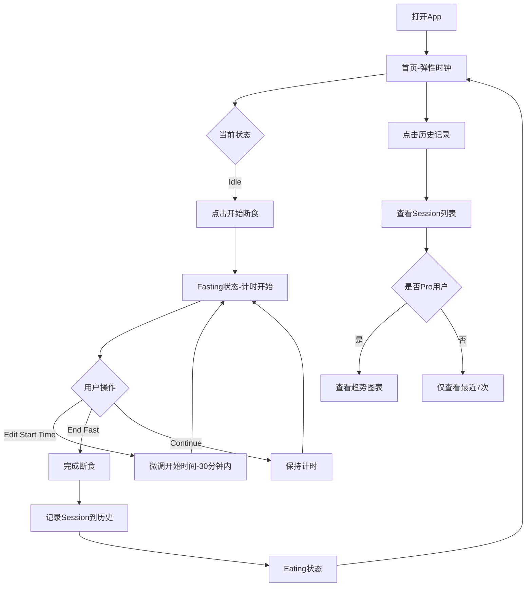
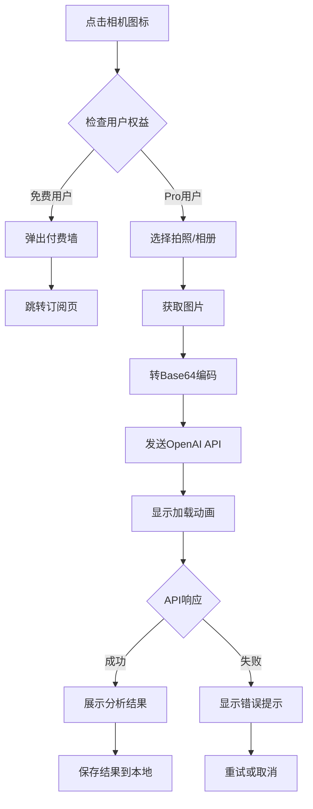
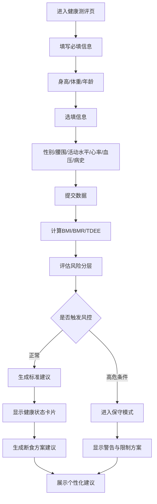

# 产品需求文档 - Flux 灵动断食

## 1. 产品概述

Flux（灵动断食）是一款顺应身体节律、提供无压力断食体验的健康管理应用，通过弹性时钟、AI餐盘分析和个性化健康评估，帮助用户科学地进行断食管理并优化健康状态。产品采用 Freemium 模式，核心工具免费，AI 智能服务付费。目标用户为关注健康管理、希望通过科学断食改善身体状态的年轻人群体。

## 2. 核心功能

### 2.1 用户角色

| 角色    | 获取方式         | 核心权限                         |
| ----- | ------------ | ---------------------------- |
| 免费用户  | 直接注册/下载      | 使用弹性时钟基础功能、查看最近7次历史记录、接收基础提醒、弹性调整时间 |
| Pro用户 | 订阅（月卡/年卡/终身） | AI餐盘分析、查看完整历史与周月趋势图表、深度数据回顾、个性化健康建议  |

**Pro会员降级规则**:
- Pro到期后保留历史数据(包括历史AI结果)
- 不可新增AI分析
- 深度趋势图表只读或不可查看

### 2.2 功能模块

Flux 断食APP需求包含以下主要页面：

1. **首页**：弹性时钟、状态显示、主操作按钮、次级操作区、AI分析入口
2. **设置页**：断食计划选择、通知开关、历史记录入口、数据清除、Pro订阅
3. **历史记录页**：Session列表展示、趋势图表（Pro）
4. **健康测评页**：生命体征输入、健康状态卡片、断食方案建议

### 2.3 页面详情

| 页面名称   | 模块名称      | 功能描述                                                                      |
| ------ | --------- | ------------------------------------------------------------------------- |
| 首页     | 弹性时钟      | 显示圆形进度条与呼吸动效、展示断食状态（Fasting/Eating/Idle/Paused/Completed）、实时计算并显示已进行/剩余时间、根据状态切换配色方案 |
| 首页     | 主操作按钮     | 开始断食、结束断食、根据状态动态显示不同按钮                                                    |
| 首页     | 次级操作区     | 修改开始时间（30分钟内微调）、补录断食（手动填写历史session）、显示断食目标时长                              |
| 首页     | AI分析入口    | 右下角悬浮相机按钮、点击判断用户权益、Pro用户进入相机、免费用户弹出付费墙                                    |
| 首页     | 状态恢复机制    | App冷启动时从AsyncStorage读取session数据、根据now时间戳重新计算状态、时区校验与异常提示、检测系统时间异常时提示补录                 |
| 设置页    | 断食计划选择    | 选择16:8/18:6/20:4方案、根据风控规则限制选择、安全模式自动禁用过长窗口                                |
| 设置页    | 通知开关      | 断食结束通知开关、通知权限状态提示、未授权时引导用户开启                                              |
| 设置页    | Pro订阅     | 显示月卡/年卡/终身买断选项、年卡显示"Save 50%"、RevenueCat集成（MVP可模拟）                        |
| 设置页    | 数据管理      | 清除数据按钮、重置所有本地存储数据、用于测试和隐私保护                                               |
| 历史记录页  | Session列表 | 按时间倒序展示断食记录、显示开始/结束时间、时长、完成状态、来源标识（补录显示特殊标记）                              |
| 历史记录页  | 趋势图表（Pro） | 周趋势图表、月趋势图表、显示完成率、平均时长、体重变化（如有数据）                                         |
| 历史记录页  | 记录详情      | 点击单个session查看详细信息、显示目标时长、实际时长、是否完成、编辑功能（仅最近记录）                            |
| 健康测评页  | 生命体征输入    | 身高/体重/年龄必填、性别/腰围/活动水平/静息心率/血压/病史选填、数据验证与范围检查                              |
| 健康测评页  | 系统状态卡片    | 体型状态卡片（BMI+分层）、代谢能量卡片（BMR/TDEE）、心血管风险卡片、肌肉保护卡片、腹部脂肪卡片、骨健康卡片               |
| 健康测评页  | 健康建议      | 生成用户现状画像、断食方案建议（窗口/频次/进食策略）、风险提示与注意事项、免责声明                                |
| 健康测评页  | 安全风控      | 年龄<18限制断食、BMI偏低限制方案、高危病史触发保守模式、生成安全提示与行动建议、高风险用户强制显示"请先咨询医生"警告                  |
| AI餐盘分析 | 相机/相册选择   | 打开相机拍照、从相册选择图片、图片转Base64处理                                                |
| AI餐盘分析 | AI分析请求    | 发送图片到OpenAI API、显示加载动画"分析营养成分中..."、超时与错误处理                                |
| AI餐盘分析 | 结果展示      | 显示热量估算、升糖指数、一句话建议、识别食物列表、置信度、关键假设、安全免责声明                                  |
| AI餐盘分析 | 风控联动      | 高风险用户额外显示谨慎提示、引导咨询专业人士、保存分析结果到本地                                          |

## 3. 商业化模式

### 3.1 收费节点

**免费用户**:
- 使用弹性时钟的所有基础功能(开始/结束/调整时间)
- 查看基础历史记录(最近7次)
- 接收本地基础提醒(若用户授予通知权限)

**Pro会员**:
- AI餐盘分析:拍照识别食物热量与升糖建议
- 深度数据回顾:查看周/月趋势图表
- 个性化健康建议:基于生命体征的智能推荐

### 3.2 定价策略

- **月卡**:$4.99 / 月
- **年卡**:$29.99 / 年(主推,显示"Save 50%")
- **终身买断**:$69.99(适合回笼资金)

### 3.3 Pro降级/到期规则

- Pro到期后:
  - 保留历史数据(包括历史AI结果,如已生成)
  - 不可新增AI分析
  - 深度趋势图表不可查看或只读

## 4. 数据模型

### 4.1 Fasting Session核心字段

- `id`: 唯一标识符
- `fasting_status`: 状态(idle | fasting | eating | paused | completed)
- `start_at`: 开始时间(实际发生)
- `end_at`: 结束时间(实际发生;未结束可为空)
- `target_duration_hours`: 目标断食时长(如16)
- `duration_minutes`: 实际断食时长(由`now - start_at`或`end_at - start_at`计算)
- `completed`: 是否达成目标(`duration >= target_duration`)
- `source`: 来源(manual_start | manual_edit | backfill | auto_recover)
- `timezone`: 记录当时的时区

### 4.2 统计口径

- "完成一次断食":`completed=true`
- "历史记录":按session展示
- "周/月趋势":基于session计算

## 5. 埋点与数据记录

### 5.1 用户行为埋点

- 基本信息填写完成率(必填/可选字段分别统计)
- 各卡片曝光/点击(用户最关心的部位/系统)
- 大模型建议采纳率(开始某方案/坚持天数)
- 安全提示触发率与原因分布
- IBW被用户编辑的比例与编辑幅度

### 5.2 功能使用埋点

- 断食开始/结束次数
- 时间调整频率
- AI分析使用次数
- 订阅转化率
- 历史记录查看频率
- 通知开启率

## 6. 核心流程

### 6.1 断食主流程

用户从进入App开始断食、调整时间、完成断食到查看历史记录的完整操作流程：

### 6.2 AI餐盘分析流程

Pro用户使用AI分析功能的完整流程：

### 6.3 健康测评流程

用户填写健康信息、生成个性化断食建议的流程：

## 7. 用户界面设计

### 7.1 设计风格

* **主色调**：

  * Fasting Mode：深海蓝渐变（Deep Blue #1e3a8a → Purple #7c3aed）

  * Eating Mode：晨曦金渐变（Soft Orange #f97316 → Warm Yellow #fbbf24）

* **次色调**：白色半透明、浅灰辅助色

* **按钮风格**：圆角3xl、磨砂玻璃效果、按压反馈动画

* **字体**：系统默认字体，标题18-20px、正文14-16px、辅助文本12px

* **布局风格**：卡片式布局、顶部导航、底部主要操作区、圆角边框

* **动画风格**：呼吸光晕动效（2-3秒循环）、平滑过渡（300-500ms）、弹性缓动

* **图标风格**：线性图标、圆角处理、2px描边

### 7.2 页面设计概述

| 页面名称  | 模块名称      | UI元素                                                               |
| ----- | --------- | ------------------------------------------------------------------ |
| 首页    | 弹性时钟      | 圆形进度条居中、呼吸光晕渐变背景、状态文字居中显示、时间数字大号字体（32-40px）、进度条粗细8-12px、渐变色彩根据状态切换 |
| 首页    | 主操作按钮     | 圆形大按钮（80-100px）、底部居中、阴影效果、点击缩放动画、文字"Start Fast"/"End Fast"白色加粗     |
| 首页    | 次级操作区     | 底部左右排列、小图标+文字、半透明背景、圆角xl、点击轻微高亮                                    |
| 首页    | AI分析入口    | 右下角悬浮按钮FAB、圆形60px、相机图标、渐变背景、阴影突出、波纹扩散动画                            |
| 设置页   | 计划选择      | 卡片式选项、大圆角、选中状态高亮边框、图标+文字、垂直排列、间距12-16px                            |
| 设置页   | Pro订阅     | 卡片式定价、年卡高亮显示、价格大号字体、"Save 50%"标签、CTA按钮渐变背景                         |
| 历史记录页 | Session列表 | 列表项卡片、左对齐时间、右对齐时长、完成状态图标、补录标记角标、点击波纹效果                             |
| 历史记录页 | 趋势图表      | 折线图、柱状图、渐变填充、图例、X轴日期、Y轴数值、交互提示                                     |
| 健康测评页 | 状态卡片      | 网格布局（2-3列）、卡片阴影、圆角xl、图标+标题+数值+状态标签、颜色区分风险等级                        |
| 健康测评页 | 输入表单      | 表单卡片、标签+输入框、验证提示、必填标识、键盘自动聚焦、数字键盘优化                                |

### 7.3 响应式设计

* **优先级**：移动端优先（Mobile-First），适配主流手机屏幕（375px - 428px宽度）

* **触控优化**：按钮最小点击区域44x44px、间距至少8px、支持手势操作

* **横屏适配**：限制竖屏显示，横屏时提示旋转设备

* **平板适配**：可选优化布局，增大点击区域、调整卡片间距

* **深色模式**：支持系统深色模式自动切换、调整背景与文字对比度

