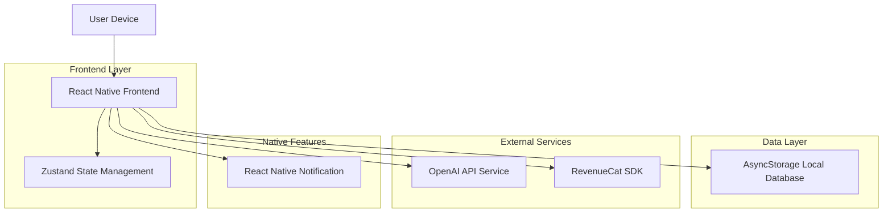
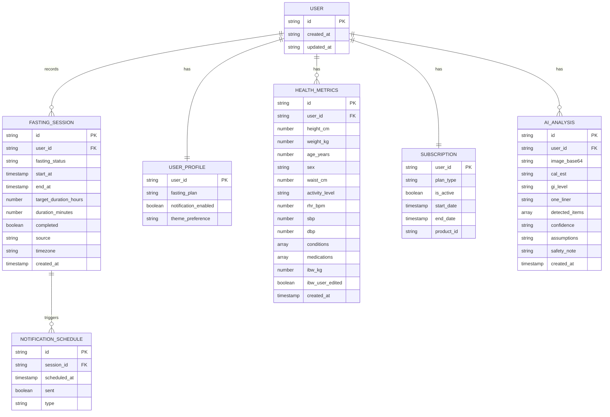

# 技术架构文档 - Flux 灵动断食

## 1. 架构设计



## 2. 技术描述

- **前端**：React Native@0.72+ + TypeScript@5+ + React Navigation@6 + Tailwind CSS@3
- **状态管理**：Zustand@4 + immer middleware
- **本地存储**：@react-native-async-storage/async-storage@1
- **通知服务**：react-native-push-notification + @react-native-community/push-notification-ios
- **AI服务**：OpenAI API（GPT-4o Vision）
- **订阅支付**：RevenueCat SDK（MVP可模拟）
- **图表组件**：react-native-chart-kit 或 victory-native
- **日期处理**：dayjs 或 date-fns
- **图片处理**：react-native-image-picker, react-native-image-resizer
- **动画效果**：react-native-reanimated

## 3. 路由定义

| 路由 | 用途 |
|------|------|
| / | 首页，弹性时钟与主要操作 |
| /settings | 设置页，计划选择、通知、数据管理 |
| /history | 历史记录页，Session列表与趋势图表 |
| /health | 健康测评页，生命体征输入与健康建议 |
| /subscription | Pro订阅页，购买与管理订阅 |
| /ai-analysis | AI餐盘分析页，拍照与结果展示 |

## 4. 数据模型

### 4.1 数据模型定义



### 4.2 数据定义语言

#### AsyncStorage 存储结构

```typescript
// 主存储键结构
interface AsyncStorageKeys {
  'user:id': string;                              // 用户唯一标识
  'user:profile': UserProfile;                    // 用户档案
  'user:subscription': Subscription;             // 订阅信息
  'user:health_metrics': HealthMetrics;           // 健康指标
  'session:current': FastingSession | null;       // 当前进行中的session
  'session:history': FastingSession[];            // 历史session列表
  'session:last_sync': string;                    // 最后同步时间
  'ai:analysis_history': AIAnalysis[];            // AI分析历史
  'notification:schedules': NotificationSchedule[]; // 通知计划
}

// 用户档案数据
interface UserProfile {
  id: string;
  fasting_plan: '16:8' | '18:6' | '20:4';
  notification_enabled: boolean;
  theme_preference: 'light' | 'dark' | 'auto';
  onboarding_completed: boolean;
  created_at: string;
  updated_at: string;
}

// 断食会话数据
interface FastingSession {
  id: string;
  user_id: string;
  fasting_status: 'idle' | 'fasting' | 'eating' | 'paused' | 'completed';
  start_at: string;  // ISO 8601 格式
  end_at: string | null;
  target_duration_hours: number;
  duration_minutes: number;
  completed: boolean;
  source: 'manual_start' | 'manual_edit' | 'backfill' | 'auto_recover';
  timezone: string;
  created_at: string;
  updated_at: string;
}

// 健康指标数据
interface HealthMetrics {
  id: string;
  user_id: string;
  height_cm: number;           // 必填
  weight_kg: number;           // 必填
  age_years: number;            // 必填
  sex: 'male' | 'female' | 'other' | 'unknown';
  waist_cm: number | null;
  activity_level: 'sedentary' | 'light' | 'moderate' | 'high';
  rhr_bpm: number | null;      // 静息心率
  sbp: number | null;          // 收缩压
  dbp: number | null;          // 舒张压
  conditions: string[];         // 病史标签
  medications: string[];        // 用药列表
  ibw_kg: number;              // 理想体重
  ibw_user_edited: boolean;    // 用户是否编辑过理想体重
  created_at: string;
  updated_at: string;
}

// 订阅数据
interface Subscription {
  user_id: string;
  plan_type: 'monthly' | 'yearly' | 'lifetime' | 'free';
  is_active: boolean;
  start_date: string;
  end_date: string | null;
  product_id: string;          // RevenueCat产品ID
  entitlement_id: string;      // RevenueCat权益ID
  updated_at: string;
}

// AI分析数据
interface AIAnalysis {
  id: string;
  user_id: string;
  image_base64: string;        // Base64编码的图片
  cal_est: string;             // 热量估算，如"450-650"
  gi_level: 'high' | 'medium' | 'low';
  one_liner: string;           // 一句话建议
  detected_items: Array<{
    name: string;
    portion: string;
    calories: number;
  }>;
  confidence: 'low' | 'medium' | 'high';
  assumptions: string;
  safety_note: string;
  created_at: string;
}

// 通知计划数据
interface NotificationSchedule {
  id: string;
  session_id: string;
  scheduled_at: string;       // 计划触发时间
  sent: boolean;
  type: 'fasting_complete' | 'halfway' | 'reminder';
  created_at: string;
}
```

#### 本地存储初始化示例

```typescript
// AsyncStorage 初始化数据结构
const initialData = {
  'user:id': generateUUID(),
  'user:profile': {
    id: '',
    fasting_plan: '16:8',
    notification_enabled: false,
    theme_preference: 'auto',
    onboarding_completed: false,
    created_at: new Date().toISOString(),
    updated_at: new Date().toISOString(),
  },
  'user:subscription': {
    user_id: '',
    plan_type: 'free',
    is_active: false,
    start_date: new Date().toISOString(),
    end_date: null,
    product_id: '',
    entitlement_id: '',
    updated_at: new Date().toISOString(),
  },
  'user:health_metrics': null,
  'session:current': null,
  'session:history': [],
  'ai:analysis_history': [],
  'notification:schedules': [],
};

// 健康指标初始数据示例
const initialHealthMetrics: HealthMetrics = {
  id: generateUUID(),
  user_id: '',
  height_cm: 170,
  weight_kg: 70,
  age_years: 30,
  sex: 'unknown',
  waist_cm: null,
  activity_level: 'light',
  rhr_bpm: null,
  sbp: null,
  dbp: null,
  conditions: [],
  medications: [],
  ibw_kg: 0,  // 由系统计算
  ibw_user_edited: false,
  created_at: new Date().toISOString(),
  updated_at: new Date().toISOString(),
};
```

## 5. 状态管理架构（Zustand Store）

### 5.1 Store 结构

```typescript
// 主要 Store 划分
interface AppStore {
  // Fasting Store
  fastingSession: FastingSession | null;
  fastingHistory: FastingSession[];
  startFasting: () => void;
  endFasting: () => void;
  pauseFasting: () => void;
  editStartTime: (newStartAt: string) => void;
  backfillSession: (data: BackfillData) => void;
  loadCurrentSession: () => Promise<void>;
  
  // User Profile Store
  userProfile: UserProfile;
  updateFastingPlan: (plan: FastingPlan) => void;
  toggleNotification: (enabled: boolean) => void;
  
  // Health Store
  healthMetrics: HealthMetrics | null;
  updateHealthMetrics: (metrics: Partial<HealthMetrics>) => void;
  calculateBMI: () => number;
  calculateBMR: () => number;
  calculateTDEE: () => number;
  getHealthAssessment: () => HealthAssessment;
  
  // Subscription Store
  subscription: Subscription;
  checkSubscriptionStatus: () => Promise<void>;
  upgradeToPro: (plan: SubscriptionPlan) => Promise<void>;
  
  // AI Store
  aiAnalysisHistory: AIAnalysis[];
  analyzeImage: (imageBase64: string) => Promise<AIAnalysis>;
  
  // Notification Store
  notificationSchedules: NotificationSchedule[];
  scheduleNotifications: (session: FastingSession) => void;
  cancelAllNotifications: () => void;
}
```

### 5.2 核心状态计算逻辑

```typescript
// 计算当前状态
const getCurrentFastingStatus = (
  session: FastingSession | null,
  now: Date = new Date()
): FastingStatus => {
  if (!session || session.fasting_status === 'idle') {
    return 'idle';
  }
  
  const elapsed = (now.getTime() - new Date(session.start_at).getTime()) / 1000 / 60; // 分钟
  const targetDuration = session.target_duration_hours * 60;
  
  if (session.end_at && new Date(session.end_at) < now) {
    return session.completed ? 'completed' : 'eating';
  }
  
  if (elapsed >= targetDuration) {
    return 'completed';
  }
  
  return 'fasting';
};

// 计算BMI
const calculateBMI = (weightKg: number, heightCm: number): number => {
  return weightKg / Math.pow(heightCm / 100, 2);
};

// 计算BMR（Mifflin-St Jeor公式）
const calculateBMR = (
  weightKg: number,
  heightCm: number,
  ageYears: number,
  sex: string
): number => {
  const base = 10 * weightKg + 6.25 * heightCm - 5 * ageYears;
  const sexAdjustment = sex === 'male' ? 5 : (sex === 'female' ? -161 : 0);
  return base + sexAdjustment;
};

// 计算TDEE
const calculateTDEE = (bmr: number, activityLevel: ActivityLevel): number => {
  const multipliers = {
    sedentary: 1.2,
    light: 1.375,
    moderate: 1.55,
    high: 1.725,
  };
  return bmr * multipliers[activityLevel];
};

// 风险评估
const assessRisk = (metrics: HealthMetrics): HealthRisk => {
  const bmi = calculateBMI(metrics.weight_kg, metrics.height_cm);
  const risks: HealthRisk = {
    cardio: 'low',
    muscle: 'low',
    visceral: 'low',
    bone: 'low',
  };
  
  // 心血管风险评估
  if (bmi >= 30 || metrics.age_years >= 60) {
    risks.cardio = 'high';
  } else if (bmi >= 25 || metrics.age_years >= 45) {
    risks.cardio = 'medium';
  }
  
  // 肌肉风险
  if (bmi < 18.5 || metrics.age_years >= 65) {
    risks.muscle = 'high';
  }
  
  // 内脏脂肪风险（需要腰围）
  if (metrics.waist_cm) {
    const waistThreshold = metrics.sex === 'female' ? 80 : 90;
    risks.visceral = metrics.waist_cm >= waistThreshold ? 'high' : 'low';
  }
  
  // 骨健康风险
  if (bmi < 18.5 && metrics.age_years >= 50) {
    risks.bone = 'high';
  }
  
  return risks;
};
```

## 6. 关键技术实现

### 6.1 通知系统实现

```typescript
// 通知调度逻辑
const scheduleFastingNotifications = async (session: FastingSession) => {
  const { start_at, target_duration_hours } = session;
  const startTime = new Date(start_at);
  const endTime = new Date(startTime.getTime() + target_duration_hours * 60 * 60 * 1000);
  
  // 取消所有现有通知
  await PushNotification.cancelAllLocalNotifications();
  
  // 调度断食结束通知
  PushNotification.localNotificationSchedule({
    title: '断食完成!',
    message: `恭喜!你已经完成了${target_duration_hours}小时断食`,
    date: endTime,
    userInfo: { type: 'fasting_complete', sessionId: session.id },
  });
  
  // 调度中间提醒(可选,每4小时提醒一次)
  const midPoint = new Date(startTime.getTime() + (target_duration_hours / 2) * 60 * 60 * 1000);
  if (midPoint > new Date()) {
    PushNotification.localNotificationSchedule({
      title: '断食进行中',
      message: '你已经完成了一半,继续加油!',
      date: midPoint,
      userInfo: { type: 'halfway', sessionId: session.id },
    });
  }
};

// 处理通知点击
PushNotification.configure({
  onNotification: function(notification) {
    if (notification.userInteraction) {
      // 用户点击通知,跳转到相应页面
      if (notification.data?.type === 'fasting_complete') {
        navigation.navigate('History');
      }
    }
  },
});
```

### 6.2 图片处理与AI分析

```typescript
// 图片选择与处理
const pickAndProcessImage = async (): Promise<string> => {
  try {
    // 选择图片
    const result = await ImagePicker.launchImageLibrary({
      mediaType: 'photo',
      quality: 0.8,
      maxWidth: 1024,
      maxHeight: 1024,
    });
    
    if (!result.assets || !result.assets[0]) {
      throw new Error('No image selected');
    }
    
    // 压缩图片
    const compressedImage = await ImageResizer.createResizedImage(
      result.assets[0].uri,
      800, // width
      800, // height
      'JPEG',
      80 // quality
    );
    
    // 转为Base64
    const base64 = await FileSystem.readAsStringAsync(compressedImage.uri, {
      encoding: FileSystem.EncodingType.Base64,
    });
    
    return `data:image/jpeg;base64,${base64}`;
  } catch (error) {
    console.error('Image processing error:', error);
    throw error;
  }
};

// 调用OpenAI API
const analyzeFoodImage = async (imageBase64: string, conditions: string[]) => {
  const systemPrompt = AI_ANALYSIS_SYSTEM_PROMPT + getHighRiskAdditionalPrompt(conditions);
  
  const response = await fetch('https://api.openai.com/v1/chat/completions', {
    method: 'POST',
    headers: {
      'Content-Type': 'application/json',
      'Authorization': `Bearer ${OPENAI_API_KEY}`,
    },
    body: JSON.stringify({
      model: 'gpt-4o',
      messages: [
        {
          role: 'system',
          content: systemPrompt,
        },
        {
          role: 'user',
          content: [
            {
              type: 'text',
              text: '请分析这张图片中的食物',
            },
            {
              type: 'image_url',
              image_url: {
                url: imageBase64,
              },
            },
          ],
        },
      ],
      max_tokens: 1000,
      temperature: 0.7,
    }),
  });
  
  if (!response.ok) {
    throw new Error('API request failed');
  }
  
  const data = await response.json();
  const content = data.choices[0].message.content;
  
  // 解析JSON响应
  try {
    return JSON.parse(content);
  } catch (error) {
    throw new Error('Failed to parse AI response');
  }
};
```

### 6.3 状态持久化与恢复

```typescript
// 保存当前session
const saveCurrentSession = async (session: FastingSession | null) => {
  try {
    await AsyncStorage.setItem('session:current', JSON.stringify(session));
    
    // 如果session正在进行,更新通知
    if (session && session.fasting_status === 'fasting') {
      await scheduleFastingNotifications(session);
    } else {
      await PushNotification.cancelAllLocalNotifications();
    }
  } catch (error) {
    console.error('Failed to save session:', error);
  }
};

// 恢复当前session
const restoreCurrentSession = async (): Promise<FastingSession | null> => {
  try {
    const sessionData = await AsyncStorage.getItem('session:current');
    if (!sessionData) return null;
    
    const session = JSON.parse(sessionData) as FastingSession;
    
    // 根据当前时间重新计算状态
    const now = new Date();
    const startTime = new Date(session.start_at);
    const elapsed = (now.getTime() - startTime.getTime()) / 1000 / 60; // 分钟
    const targetDuration = session.target_duration_hours * 60;
    
    // 检查是否应该结束
    if (session.end_at && new Date(session.end_at) < now) {
      session.fasting_status = session.completed ? 'completed' : 'eating';
    } else if (elapsed >= targetDuration) {
      session.fasting_status = 'completed';
      session.completed = true;
      session.duration_minutes = elapsed;
    } else {
      session.fasting_status = 'fasting';
      session.duration_minutes = elapsed;
    }
    
    // 检查时区是否一致
    const currentTimezone = Intl.DateTimeFormat().resolvedOptions().timezone;
    if (session.timezone !== currentTimezone) {
      // 提示用户时区变化
      console.warn('Timezone changed:', session.timezone, '->', currentTimezone);
    }
    
    // 检查系统时间是否异常
    if (now < startTime) {
      console.error('System time is before session start time');
      // 提示用户系统时间异常
      throw new Error('System time anomaly detected');
    }
    
    return session;
  } catch (error) {
    console.error('Failed to restore session:', error);
    return null;
  }
};
```

## 7. API 定义

### 7.1 OpenAI Vision API

**图像分析请求**

```
POST https://api.openai.com/v1/chat/completions
```

Headers:
| 参数名 | 类型 | 必需 | 描述 |
|-------|------|------|------|
| Authorization | string | true | Bearer {API_KEY} |
| Content-Type | string | true | application/json |

Request Body:
```json
{
  "model": "gpt-4o",
  "messages": [
    {
      "role": "system",
      "content": "你是一个专业的营养师，请分析这张图片中的食物。只返回JSON格式，不要包含其他文字。输出字段：cal_est（热量估算，如\"450-650\"）、gi_level（high/medium/low）、one_liner（一句话建议，20字以内）、detected_items（最多5个主要食物，包含name、portion、calories）、confidence（low/medium/high）、assumptions（关键假设）、safety_note（固定短句：\"仅供参考，不替代专业建议\"）。"
    },
    {
      "role": "user",
      "content": [
        {
          "type": "text",
          "text": "请分析这张图片中的食物"
        },
        {
          "type": "image_url",
          "image_url": {
            "url": "data:image/jpeg;base64,{base64_image}"
          }
        }
      ]
    }
  ],
  "max_tokens": 1000,
  "temperature": 0.7
}
```

Response:
| 参数名 | 类型 | 描述 |
|-------|------|------|
| choices | array | 响应选项列表 |
| choices[].message.content | string | AI返回的JSON字符串 |

Example Response:
```json
{
  "cal_est": "450-650",
  "gi_level": "medium",
  "one_liner": "均衡搭配，适量控制主食",
  "detected_items": [
    {"name": "米饭", "portion": "1碗", "calories": 200},
    {"name": "鸡胸肉", "portion": "100g", "calories": 165},
    {"name": "西兰花", "portion": "100g", "calories": 35}
  ],
  "confidence": "medium",
  "assumptions": "按标准餐份量估算，实际热量可能因烹饪方式有所不同",
  "safety_note": "仅供参考，不替代专业建议"
}
```

### 7.2 RevenueCat API（MVP模拟）

**购买订阅**

```
POST /api/subscription/purchase
```

Request:
| 参数名 | 类型 | 必需 | 描述 |
|-------|------|------|------|
| plan_type | string | true | 订阅计划：monthly/yearly/lifetime |
| product_id | string | true | RevenueCat产品ID |

Response:
```json
{
  "success": true,
  "subscription": {
    "plan_type": "yearly",
    "is_active": true,
    "start_date": "2026-01-09T00:00:00Z",
    "end_date": "2027-01-09T00:00:00Z"
  }
}
```

**查询订阅状态**

```
GET /api/subscription/status
```

Response:
```json
{
  "plan_type": "yearly",
  "is_active": true,
  "remaining_days": 365,
  "features": ["ai_analysis", "trends"]
}
```

## 8. 项目结构规划

```
src/
├── components/          # 通用组件
│   ├── FastingClock/
│   ├── StatusIndicator/
│   ├── PrimaryActionButton/
│   ├── SecondaryActions/
│   ├── AIAnalysisFAB/
│   ├── SessionItem/
│   ├── HealthStatusCards/
│   ├── PaywallModal/
│   └── EditTimeModal/
├── pages/              # 页面组件
│   ├── HomeScreen/
│   ├── HistoryScreen/
│   ├── HealthScreen/
│   └── SettingsScreen/
├── hooks/              # 自定义Hook
│   ├── useFastingTimer/
│   ├── useNotifications/
│   ├── useAIAnalysis/
│   ├── useHealthMetrics/
│   └── useSubscription/
├── store/              # Zustand Store
│   ├── fastingStore.ts
│   ├── healthStore.ts
│   ├── subscriptionStore.ts
│   └── index.ts
├── utils/              # 工具函数
│   ├── dateUtils.ts
│   ├── calculations.ts
│   ├── validation.ts
│   └── constants.ts
├── api/                # API服务
│   ├── openai.ts
│   └── revenuecat.ts
├── types/              # TypeScript类型定义
│   ├── fasting.ts
│   ├── health.ts
│   ├── subscription.ts
│   └── ai.ts
├── navigation/         # 导航配置
│   ├── TabNavigator.tsx
│   └── ModalNavigator.tsx
└── App.tsx
```

## 9. 组件架构

### 9.1 主要组件树

```
App
├── NavigationContainer
│   ├── TabNavigator
│   │   ├── HomeScreen
│   │   │   ├── FastingClock
│   │   │   ├── StatusIndicator
│   │   │   ├── PrimaryActionButton
│   │   │   ├── SecondaryActions
│   │   │   └── AIAnalysisFAB
│   │   ├── HistoryScreen
│   │   │   ├── SessionList
│   │   │   ├── SessionItem
│   │   │   └── TrendCharts (Pro)
│   │   ├── HealthScreen
│   │   │   ├── HealthMetricsForm
│   │   │   ├── HealthStatusCards
│   │   │   └── HealthRecommendations
│   │   └── SettingsScreen
│   │       ├── FastingPlanSelector
│   │       ├── NotificationToggle
│   │       ├── DataManagement
│   │       └── SubscriptionCard
│   ├── ModalNavigator
│   │   ├── AIAnalysisModal
│   │   ├── PaywallModal
│   │   └── EditTimeModal
```

### 7.2 核心组件职责

| 组件名称 | 职责描述 | Props |
|---------|---------|-------|
| FastingClock | 显示圆形进度条、呼吸动效、时间数字、状态切换动画 | session, theme |
| StatusIndicator | 显示当前断食状态文字、进度百分比、剩余时间 | status, elapsed, target |
| PrimaryActionButton | 开始/结束断食的主按钮，根据状态显示不同文字和行为 | status, onStart, onEnd |
| SecondaryActions | 修改开始时间、补录断食等次要操作 | onEditStart, onBackfill |
| AIAnalysisFAB | 右下角悬浮按钮，触发AI分析 | onPress |
| SessionList | 历史记录列表，支持分页加载 | sessions, onSelect, onLoadMore |
| SessionItem | 单个session卡片，显示时间、时长、完成状态 | session, onPress |
| TrendCharts | 周月趋势图表，Pro专属 | data, type |
| HealthStatusCards | 健康状态卡片网格，显示各项指标 | metrics, risks |
| HealthMetricsForm | 健康信息输入表单 | metrics, onSubmit |
| FastingPlanSelector | 断食计划选择器，支持风控限制 | currentPlan, onSelect, isRestricted |
| NotificationToggle | 通知开关，显示权限状态 | enabled, onChange, permissionStatus |
| PaywallModal | Pro订阅付费墙，展示定价和功能对比 | features, onSubscribe, currentPlan |
| EditTimeModal | 修改开始时间的模态框，支持时间选择 | session, onSave, onCancel |

## 10. 安全性与风控策略

### 9.1 数据安全

- **本地数据加密**: AsyncStorage存储敏感信息时使用加密算法
- **API密钥管理**: OpenAI API密钥不硬编码,使用环境变量或安全存储
- **用户隐私**: 不收集用户个人身份信息,所有数据仅存储在本地设备
- **图片处理**: AI分析图片不上传到服务器,仅发送到OpenAI API且不持久化

### 9.2 断食安全风控规则

```typescript
// 风控条件判断
interface SafetyRules {
  // 禁止断食的条件
  shouldBlockFasting: boolean;
  // 限制断食窗口的条件
  shouldRestrictPlan: boolean;
  // 最大允许断食时长
  maxFastingHours: number;
  // 需要额外警告的条件
  needsWarning: boolean;
}

const evaluateSafetyRules = (metrics: HealthMetrics): SafetyRules => {
  const rules: SafetyRules = {
    shouldBlockFasting: false,
    shouldRestrictPlan: false,
    maxFastingHours: 20,
    needsWarning: false,
  };

  // 年龄 < 18: 禁止断食
  if (metrics.age_years < 18) {
    rules.shouldBlockFasting = true;
    return rules;
  }

  // BMI偏低: 限制断食方案
  const bmi = calculateBMI(metrics.weight_kg, metrics.height_cm);
  if (bmi < 18.5) {
    rules.shouldRestrictPlan = true;
    rules.maxFastingHours = 12;
  }

  // 高危病史: 禁止断食或严格限制
  const highRiskConditions = [
    'diabetes_medication',
    'pregnancy',
    'breastfeeding',
    'eating_disorder',
    'severe_liver_disease',
    'severe_kidney_disease',
  ];
  
  const hasHighRiskCondition = metrics.conditions.some(c => 
    highRiskConditions.includes(c)
  );
  
  if (hasHighRiskCondition) {
    rules.shouldBlockFasting = true;
  }

  // 老年用户: 限制断食时长
  if (metrics.age_years >= 65) {
    rules.maxFastingHours = 16;
    rules.needsWarning = true;
  }

  // 心血管风险高: 需要警告
  if (bmi >= 30 || metrics.age_years >= 60) {
    rules.needsWarning = true;
  }

  return rules;
};

// 断食过程中的异常监测
interface FastingSymptoms {
  dizziness: boolean;      // 头晕
  palpitations: boolean;    // 心悸
  cold_sweats: boolean;     // 出冷汗
  weakness: boolean;       // 虚弱
  nausea: boolean;          // 恶心
}

const evaluateSymptomSafety = (symptoms: FastingSymptoms): {
  shouldStop: boolean;
  severity: 'low' | 'medium' | 'high';
  recommendation: string;
} => {
  const severityCounts = {
    high: 0,
    medium: 0,
    low: 0,
  };

  if (symptoms.palpitations) severityCounts.high++;
  if (symptoms.cold_sweats) severityCounts.high++;
  if (symptoms.dizziness) severityCounts.medium++;
  if (symptoms.nausea) severityCounts.medium++;
  if (symptoms.weakness) severityCounts.low++;

  if (severityCounts.high >= 1) {
    return {
      shouldStop: true,
      severity: 'high',
      recommendation: '立即停止断食,补充电解质,如症状持续请就医',
    };
  }

  if (severityCounts.medium >= 2) {
    return {
      shouldStop: true,
      severity: 'medium',
      recommendation: '建议停止断食,补充水分和电解质,注意休息',
    };
  }

  return {
    shouldStop: false,
    severity: 'low',
    recommendation: '注意观察身体反应,如有不适及时停止',
  };
};
```

### 9.3 AI分析安全约束

```typescript
// AI分析的系统提示词
const AI_ANALYSIS_SYSTEM_PROMPT = `
你是一个专业的营养师,请分析这张图片中的食物。

重要约束:
1. 只返回JSON格式,不要包含其他文字
2. 不要进行医学诊断或治疗建议
3. 必须包含安全免责声明
4. 热量估算要给出合理区间
5. 对于模糊的食物,使用"unknown"标识
6. 必须声明估算的不确定性

输出字段:
- cal_est: 热量估算区间,如"450-650"
- gi_level: 升糖指数,high/medium/low
- one_liner: 一句话建议,20字以内
- detected_items: 最多5个主要食物
- confidence: 置信度,low/medium/high
- assumptions: 关键假设
- safety_note: 固定免责声明

安全提示:
如果识别到明显不健康的食物组合,必须在one_liner中提示。
`;

// 高风险用户的额外提示
const getHighRiskAdditionalPrompt = (conditions: string[]): string => {
  if (conditions.includes('diabetes')) {
    return '\n\n特别提醒:用户有糖尿病病史,请特别关注升糖指数,给出更谨慎的建议。';
  }
  if (conditions.includes('pregnancy') || conditions.includes('breastfeeding')) {
    return '\n\n特别提醒:用户处于孕哺期,请强调营养均衡和充足热量摄入。';
  }
  return '';
};
```

## 11. 部署方案

### 10.1 开发环境

- **依赖管理**: npm/yarn
- **代码规范**: ESLint + Prettier
- **类型检查**: TypeScript strict mode
- **测试**: Jest + React Native Testing Library
- **版本控制**: Git

### 10.2 生产环境

- **iOS打包**: Xcode + Apple Developer账号
- **Android打包**: Android Studio + 签名密钥
- **App Store上架**: 通过人工流程(由User负责)
- **Google Play上架**: 可选
- **环境变量配置**:
  - OPENAI_API_KEY: OpenAI API密钥
  - REVENUECAT_API_KEY: RevenueCat公钥

### 10.3 监控与日志

- **错误监控**: Sentry(可选)
- **性能监控**: React Native Performance
- **用户行为埋点**: 自定义埋点系统
- **本地日志**: AsyncStorage存储关键操作日志

### 10.4 数据备份与恢复

- **数据导出**: 支持导出用户数据为JSON格式
- **数据导入**: 支持从备份文件恢复数据
- **数据清除**: 一键清除所有本地数据
- **隐私保护**: 数据清除后无法恢复

## 12. 性能优化

### 11.1 启动优化

- 延迟加载非关键组件
- 预加载常用数据
- 优化图片资源
- 使用懒加载路由

### 11.2 运行时优化

- 使用React.memo避免不必要的重渲染
- 优化列表渲染(使用FlatList)
- 图片懒加载和压缩
- 减少状态更新频率

### 11.3 存储优化

- AsyncStorage数据定期清理
- 压缩历史数据存储
- 限制AI分析历史数量(最多保留最近100条)
- 缓存计算结果避免重复计算
